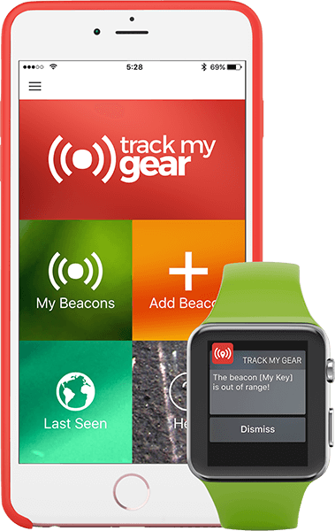

# Ionic iBeacon Notification App
Copyright Sem Kokhuis / Made with Pepper (2014-2016) - This software is licensed under the GNU LGPLv3.

**Get a notification when your smartphone enters or exits the beacon region.**

https://madewithpepper.com/track-my-gear

## Prerequisites
The following libraries are required:

 - [NodeJS](https://www.nodejs.org)
 - [NPM](https://www.npmjs.com)
 - [Ionic and Cordova](http://ionicframework.com/docs/guide/installation.html)
 - [Bower](http://bower.io)
 - [Gulp](http://gulpjs.com)

## Installation
After you've downloaded the project, navigate to the root directory with your CLI.

### Install required NPM packages
`$ npm install`

### Install Bower JavaScript libraries
`$ bower install`

### Copy latest JavaScript libraries to project directory
In order to keep the app size small, we only copy the files required for app usage. See `gulpfile.js` for the associated task.

`$ gulp copy`

If you get a message like:
> `libsass` bindings not found. Try reinstalling `node-sass`?

try the following:

`$ npm update`

### Add Cordova plugins
`$ ionic state restore`

### Add platforms
Finally we can add the platform(s) as we're used with Ionic. For more information, visit http://ionicframework.com/docs/guide/installation.html.

For example:

`$ ionic platform add android`
`$ ionic run android`

## Configuration

### config.xml
Make sure you update the config.xml in the root with a name and version for your app.

### App icon and splash screen
For more information on generating splash screen and icon images for all formats, visit http://ionicframework.com/docs/cli/icon-splashscreen.html.

### Logo
You can replace the Made with Pepper logo at /www/img/logos/app-logo-home.svg.

### Help content
Update the help view at /www/templates/help.html.

### Languages
Language files can be found at the /www/i18n/ directory. To add a new language:
- Copy a language file (e.g. en.json) and rename it to the language code you want to add a translation for (e.g. de.json).
- Open /www/templates/settings.html and add the language to the language select. E.g.: `<option value="de">Deutsch</option>`.